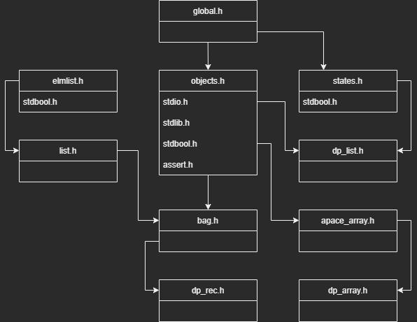

# L2_Projet_ProgAv-S3

Projet de programmation avancée fait en L2 Info durant le S3.  
Par [Brice ORLIANGE](mailto:briceorl54580@gmail.com) et [Antoine SCANU](mailto:antoine.scanu1@gmail.com) du groupe TD2 et TP4.

________________________

# Projet en lui-même

## Renommage

> Certaine partie du code son pas forcément facile à comprendre ou à lire.  
> Nous sommet permit de renommer certain fichier, fonction, structure et variable. Cela à pour but de **travaillé** dans les **meilleurs condition possible**.  
> Nous évitons de donnée des nouveaux noms qui poserai problème à la lecture de notre très cher professeur.  
> Dans la majorité des cas, nous allons respecter la **norme de nomination** en **C** qui est le **camelCase**.

### Fichier changer

- Le fichier `prec.h` est renommé en `db_rec.h`. `db_rec.c` et `db_rec.h` les mêmes noms pour la même chose.

### Variables changer

- `newbagpack` -> `newBagpack`
- `ptrf` -> `ptrF`
- `numelm` -> `numElm`
- `ptrf` & `cmp_ptrf` => `ptrF`

## Agencement des includes dans les fichiers `.h`

Voici l'agencement des différents `#include` dans le projet :  
  
> Les trois derniers blocs en rose _(dp_rec.h, dp_array.h et dp_list.h)_ sont les trois `#include` à faire dans le `main.c` pour qu'il puisse fonctionner.

## Fonctionnement

###