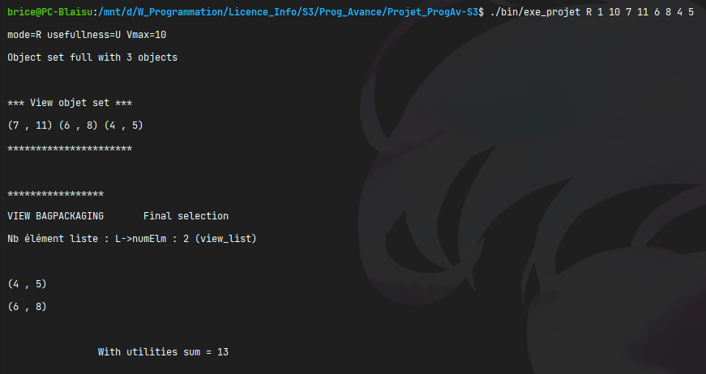
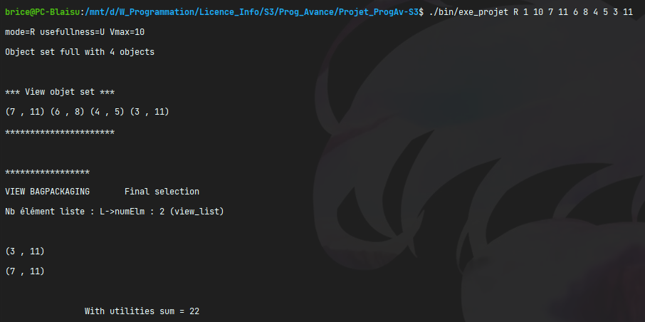

# L2_Projet_ProgAv-S3

Projet de programmation avancée fait en L2 Info durant le S3.  
Par [Brice ORLIANGE](mailto:briceorl54580@gmail.com) et [Antoine SCANU](mailto:antoine.scanu1@gmail.com) du groupe TD2 et TP4.

________________________

# Projet en lui-même

## 1. Renommage

> Certaine partie du code ne sont pas forcément facile à comprendre ou à lire.  
> Nous nous sommes permit de renommer certains fichiers, fonctions, structures et variables. Cela pour travailler dans les meilleurs conditions possible.
> Nous évitons de donner de nouveaux noms qui poseraient problèmes à la lecture de notre professeur.  
> Dans la majorité des cas, nous allons respecter la **norme de nomination** en C, le **camelCase**.

### 1.1 Fichier changé

- Le fichier `prec.h` est renommé en `db_rec.h`. `db_rec.c` et `db_rec.h` les mêmes noms pour la même chose.

### 1.2. Variables changées

- `newbagpack` -> `newBagpack`
- `ptrf` -> `ptrF`
- `numelm` -> `numElm`
- `ptrf` & `cmp_ptrf` & `ptr_fct` => `ptrF`
- `Vmax` -> `VMax`
- `nonstop` -> `nonStop`
- `ptr_object` -> `object`
- `obj_idx` -> `object_idx`


## 2. Création de nouveau fichier 

### 2.1. `outils.c` & `outils.h`
Nous avons créé ces deux fichiers pour mettre à notre disposition les outils nécessaire pour réussir le projet.  
Fonction :
- `void rmInteger(int *i)`


## 3. Agencement des includes dans les fichiers `.h`

Voici l'agencement des différents `#include` dans les `.h` ce trouvent dans le projet :  
  
> Les trois derniers blocs en rose _(dp_rec.h, dp_array.h et dp_list.h)_ sont les trois `#include` à faire appel dans le `main.c` pour qu'il puisse fonctionner.


## 4. Agencement & avancement des fonctions

Voici les fonctions que nous avons réussies à faire durant le projet :  

> Sur l'image, il y a la légende de la signification de chaque couleur.  
> Voici Les rôles de chaque ligne :
> - **1ᵉ ligne** : L'état des fonctions au début du projet _("À remplir" ou "Vide")_.
> - **2ᵉ ligne** : Les fonctions en cours _("En cours")_.
> - **3ᵉ ligne** : Les fonctions terminées. Indique si la fonction est finie et non-test _("Fini, à vérifier")_, si terminé et fonctionnel _("Fini, c'est ok")_, s'il vient (inspirer) d'un TP _("Copier d'un TP")_ ou s'il était donné au début du TP _("Donner")_.
> - **4ᵉ ligne** : Les fonctions qui sont complete ou faite entièrement, mais qui ne sont pas fonctionnel _("Erreur")_.


## 5. Fonctionnement

### 5.1. Dans le makefile
Dans la **première étape** pour pouvoir exécuter le projet correctement, il faut lancer la commande `make` dans un terminal **Linux**. 
#### 5.1.1. L'exécutable
Le nom de l'exécutable du projet est `exe_projet`.
```shell
_PROG = exe_projet
```
#### 5.1.2. Défini tous les `.h`
Nous avons fait appel à tous les `.h`.
```shell
_DEP = outils.h objects.h elmlist.h list.h bag.h dp_rec.h space_array.h dp_array.h # global.h states.h dp_list.h
```
> On n'a pas fait appel au fichier `global.h` car il posait problème au moment de la compilation `make`.
#### 5.1.3. Défini tous les `.o`
Nous avons défini tous les `.o`
```shell
_OBJ = main.o outils.o objects.o elmlist.o list.o bag.o dp_rec.o space_array.o dp_array.o # global.o states.o dp_list.o
```
> Comme avant, nous avons fait avant on n'a pas défini `global.o` pour la même raison. 

### 5.2. À l'exécution
La **deuxième étape** pour pouvoir exécuter le projet. Il faut lancer cette commande **ci-dessous** dans un terminal **Linux**.
```shell
./exe_projet mode utilité VMax volume1 utilité1 volume2 utilité2 ... volumeN utilitéN
```
> Voici les différentes options a rentrées et leur utilité :
> - **mode** _(R|A|L)_ : Choisi la méthode d'exécution entre recursive _(R)_, array _(A)_ et liste _(L)_.
> - **utilité** _(0|1)_ : Défini si on défini le volume _(1)_ ou pas _(0)_. S'il n'est pas défini alors l'utilité prendra le volume comme valeur.
> - **VMax** : Défini le volume maximal que le sac peut avoir.
> - **volumeN** : Volume du Nème objet.
> - **utilitéN** : Utilité du Nème objet.

### 5.3 Test 

#### 5.3.1 Récursive

##### Exemple 1 - utilité = 1
```shell
./bin/exe_projet R 1 10 7 11 6 8 4 5
```

##### Exemple 1 - utilité = 0
```shell
./bin/exe_projet R 0 10 7 11 6 8 4 5
```

##### Exemple 2 - utilité = 1
```shell
./bin/exe_projet R 1 10 7 11 6 8 4 5 3 11
```

##### Exemple 2 - utilité = 0
```shell
./bin/exe_projet R 0 10 7 11 6 8 4 5 3 11
```

#### 5.3.2 Array 


#### 5.3.3 Liste
