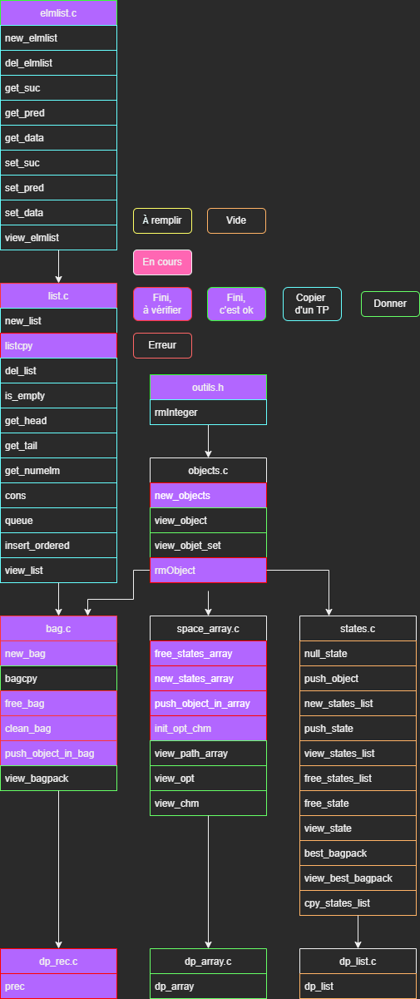

# L2_Projet_ProgAv-S3

Projet de programmation avancée fait en L2 Info durant le S3.  
Par [Brice ORLIANGE](mailto:briceorl54580@gmail.com) et [Antoine SCANU](mailto:antoine.scanu1@gmail.com) du groupe TD2 et TP4.

________________________

# Projet en lui-même

## Renommage

> Certaine partie du code son pas forcément facile à comprendre ou à lire.  
> Nous sommet permit de renommer certain fichier, fonction, structure et variable. Cela à pour but de **travaillé** dans les **meilleurs condition possible**.  
> Nous évitons de donnée des nouveaux noms qui poserai problème à la lecture de notre très cher professeur.  
> Dans la majorité des cas, nous allons respecter la **norme de nomination** en **C** qui est le **camelCase**.

### Fichier changer

- Le fichier `prec.h` est renommé en `db_rec.h`. `db_rec.c` et `db_rec.h` les mêmes noms pour la même chose.

### Variables changer

- `newbagpack` -> `newBagpack`
- `ptrf` -> `ptrF`
- `numelm` -> `numElm`
- `ptrf` & `cmp_ptrf` & `ptr_fct` => `ptrF`
- `Vmax` -> `VMax`
- `nonstop` -> `nonStop`
- `ptr_object` -> `object`

## Création de nouveau fichier 

### `outils.c` & `outils.h`
Nous avons créé ces deux fichiers pour mettre à notre disposition des outils nécessaire pour réussir à faire le projet.  
Fonction :
- `void rmInteger(int *i)`

## Agencement des includes dans les fichiers `.h`

Voici l'agencement des différents `#include` dans les `.h` ce trouvent dans le projet :  
  
> Les trois derniers blocs en rose _(dp_rec.h, dp_array.h et dp_list.h)_ sont les trois `#include` à faire appel dans le `main.c` pour qu'il puisse fonctionner.

## Agencement & avancement des fonctions

Voici les fonctions que nous avons réussies à faire durant le projet :  

> Sur l'image, il y a la légende de la signification de chaque couleur.  
> Voici Les rôles de chaque ligne :
> - **1er ligne** : L'état des fonctions au début du projet _("À remplir" ou "Vide")_.
> - **2ème ligne** : Les fonctions en cours _("En cours")_.
> - **3ème ligne** : Les fonctions terminer. Indiqué si la fonction est finie est non-test _("Fini, à vérifier")_, si terminer est fonctionnel _("Fini, c'est ok")_, s'il vient (inspirer) d'un TP _("Copier d'un TP")_ ou s'il a était donner au début _("Donner")_.
> - **4ème ligne** : Les fonctions qui étaient complete ou faite entièrement, mais qu'ils ne sont pas fonctionnel _("Erreur")_.

## Fonctionnement

