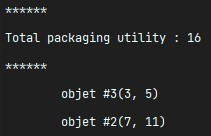

# L2_Projet_ProgAv-S3

Projet de programmation avancée fait en L2 Info durant le S3.  
Par [Brice ORLIANGE](mailto:briceorl54580@gmail.com) et [Antoine SCANU](mailto:antoine.scanu1@gmail.com) du groupe TD2 et TP4.

________________________

# Projet en lui-même

## 1. Renommage

> Certaines parties du code ne sont pas forcément facile à comprendre ou à lire.  
> Nous nous sommes donc permis de renommer certaines  fonctions, structures, variables et fichiers. Cela pour travailler dans les meilleurs conditions possible.  
> Nous évitons de donner de nouveaux noms qui poseraient problèmes à la lecture.  
> Dans la majorité des cas, nous allons respecter la **norme de nomination** en C, le **camelCase**.  

### 1.1 Fichier changé

- Le fichier `prec.h` est renommé en `db_rec.h`. `db_rec.c` et `db_rec.h` les mêmes noms pour la même chose.

### 1.2. Variables changées

- `newbagpack` -> `newBagpack`
- `ptrf` -> `ptrF`
- `numelm` -> `numElm`
- `ptrf` & `cmp_ptrf` & `ptr_fct` => `ptrF`
- `Vmax` -> `VMax`
- `nonstop` -> `nonStop`
- `ptr_object` -> `object`
- `obj_idx` -> `object_idx`


## 2. Création de nouveau fichier 

### 2.1. `outils.c` & `outils.h`
Nous avons créé ces deux fichiers pour mettre à notre disposition tous les outils nécessaire pour réussir le projet.  
Fonction :
- `void rmInteger(int *i)`


## 3. Agencement des includes dans les fichiers `.h`

Voici l'agencement des différents `#include` dans les `.h` qui se trouvent dans le projet :  
  
> Les trois derniers blocs en rose _(dp_rec.h, dp_array.h et dp_list.h)_ sont les trois `#include` à faire appel dans le `main.c` pour qu'il puisse fonctionner.


## 4. Agencement & avancement des fonctions

Voici les fonctions que nous avons réussies à faire durant le projet :

> Sur l'image, il y a la légende de la signification de chaques couleurs.  
> Voici Les rôles de chaques lignes :
> - **1ᵉ ligne** : L'état des fonctions au début du projet _("À remplir" ou "Vide")_.
> - **2ᵉ ligne** : Les fonctions en cours de développement _("En cours")_.
> - **3ᵉ ligne** : Les fonctions terminées. Indique si la fonction est finie et non vérifié _("Fini, à vérifier")_, si terminé et fonctionnel _("Fini, c'est ok")_, s'il vient (inspirer) d'un TP _("Copier d'un TP")_ ou s'il était donné au début du TP _("Donner")_.
> - **4ᵉ ligne** : Les fonctions complètes, mais non fonctionnel avec erreur identifiée _("Erreur")_.


## 5. Fonctionnement

### 5.1. Makefile & la commande `make`

#### 5.1.1. L'exécutable
Le nom de l'exécutable du projet est `exe_projet`.
```shell
_PROG = exe_projet
```

#### 5.1.2. Défini tous les `.h`
Nous avons fait appel à tous les `.h` dans le **Makefile** pour le lancement de la commande `make`.
Voici la ligne de code dans **Makefile** :  
```shell
_DEP = outils.h objects.h elmlist.h list.h bag.h dp_rec.h space_array.h dp_array.h # global.h states.h dp_list.h
```
> Nous n'avons pas fait appel au fichier `global.h` car il posait problème au moment de la compilation `make`.  
> Nous n'avons pas fait appel aux fichiers `states.h` et `dp_list.h` car nous n'avons pas finis la partie sur la liste.

#### 5.1.3. Défini tous les `.o`
Nous avons défini tous les `.o` dans le **Makefile** pour quand on lancera la commande `make`.
Voici la ligne de code dans **Makefile** :  
```shell
_OBJ = main.o outils.o objects.o elmlist.o list.o bag.o dp_rec.o space_array.o dp_array.o # global.o states.o dp_list.o
```
> Comme ennoncé précedemment, nous n'avons pas défini `global.o` pour la même raison que le `.h`.  
> Nous n'avons pas fait appel aux fichiers `states.o` et `dp_list.o` car nous n'avons pas finis la partie sur la liste.

### 5.1.4 Lancement de la commande `make`
**Première étape** pour pouvoir exécuter le projet correctement.  
Il faut lancer la commande `make` dans un terminal **Linux**.  
S'il y a un ou des éléments dans le dossier `bin` et/ou dans le dossier `obj`, penser à lancer la commande `make delete` pour les vider avant le `make`.

### 5.2. À l'exécution
**Deuxième étape** pour pouvoir exécuter le projet.  
Il faut lancer la commande **ci-dessous** dans un terminal **Linux** :
```shell
./bin/exe_projet mode utilité VMax volume1 utilité1 volume2 utilité2 ... volumeN utilitéN
```
> Voici les différentes options a entrer et leur utilité :
> - **mode** _(R|A|L)_ : Choisi la méthode d'exécution entre recursive _(R)_, array _(A)_ et liste _(L)_.
> - **utilité** _(0|1)_ : Défini si on défini le volume _(1)_ ou pas _(0)_. S'il n'est pas défini alors l'utilité prendra le volume comme valeur.
> - **VMax** : Défini le volume maximal que le sac peut avoir.
> - **volumeN** : Volume du Nème objet.
> - **utilitéN** : Utilité du Nème objet.


## 6 Test du projet
Nous vous présentons quelque test que nous avons effectué sur le projet.

### 6.1 Récursive
Pour la partie récursive, nous aurons le mode `R` et nous prendrons un volume maximal _(VMax)_ de **10** pour tous les tests.

#### 6.1.1 Exemple 1.1 - utilité = 1
Voici la commande pour le premier test :
```shell
./bin/exe_projet R 1 10 7 11 6 8 4 5
```
Voici le résultat du test :


#### 6.1.2 Exemple 1.2 - utilité = 0
Voici la commande pour le premier test :
```shell
./bin/exe_projet R 0 10 7 11 6 8 4 5
```
Voici le résultat du test :


#### 6.1.3 Exemple 2.1 - utilité = 1
Voici la commande pour le premier test :
```shell
./bin/exe_projet R 1 10 7 11 6 8 4 5 3 11
```
Voici le résultat du test :


#### 6.1.4 Exemple 2.2 - utilité = 0
Voici la commande pour le premier test :
```shell
./bin/exe_projet R 0 10 7 11 6 8 4 5 3 11
```
Voici le résultat du test :


#### 6.1.5 Conclusion
La méthode récursive a un defaut.
Dans le cas où il y a deux possibilités d'objet avec la même valeur d'**utilité**, il choisira le premier sac venu sans prendre compte si les autres sacs sont moins vide que le premier.  

Voici un exemple de ce qui arrive juste au-dessus :  

> On aurait dû avoir le couple `(6, 11)` et `(3, 5)` qui aurait fait baisser le volume de 1.

### 6.2 Array 
Pour la partie récursive, nous aurons le mode `A` et nous prendrons un volume maximal _(VMax)_ de **10** pour tous les tests.  
> Le mode array n'est pas fonctionnel, mais affiche quelque chose.

#### 6.2.1 Exemple 1.1 - utilité = 1
Voici la commande pour le premier test :
```shell
./bin/exe_projet A 1 10 7 11 6 8 4 5
```
Voici le résultat du test (visualisation complete) :
   


#### 6.2.2 Exemple 1.2 - utilité = 0
Voici la commande pour le premier test :
```shell
./bin/exe_projet A 0 10 7 11 6 8 4 5
```
Voici le résultat du test (visualisation partielle) :
  
***...*** _(Visualisation des sacs)_  


#### 6.2.3 Exemple 2.1 - utilité = 1
Voici la commande pour le premier test :
```shell
./bin/exe_projet A 1 10 7 11 6 8 4 5 3 11
```
Voici le résultat du test (visualisation partielle) :
  
***...*** _(Visualisation des sacs)_  


#### 6.2.4 Exemple 2.2 - utilité = 0
Voici la commande pour le premier test :
```shell
./bin/exe_projet A 0 10 7 11 6 8 4 5 3 11
```
Voici le résultat du test (visualisation partielle) :
  
***...*** _(Visualisation des sacs)_  


#### 6.2.5 Conclusion
La méthode array a aussi un défaut du même style la méthode récursive.  
Il sagit du cas où il y a deux possibilités avec la même valeur d'**utilité**. Dans ce cas, il enverra le dernier sac qui est venu sans prendre en compte si les sacs d'avant était moins vide que le dernier.  

Voici un exemple de ce qui arrive juste au-dessus :  
  
***...*** _(Visualisation des sacs)_  
  
> On aurait dû avoir le couple `(6, 11)` et `(3, 5)` qui aurait fait baisser le volume de 1.  

### 6.3 Liste
Pour la partie récursive, nous aurons le mode `L` _(on peut mettre n'importe quel lettre sauf `R` et `A`)_ et on prendra un volume maximal _(VMax)_ de **10** pour tous les tests.  

### 6.3.1 Pas de test
Nous ne pouvons pas effectuer de test, car nous n'avons pas finis la partie liste du projet _(mode `L`)_.  
Pour que le projet marche sans problème nous avons mis toute la partie qui fait appel à la liste dans le `main.c` en commentaire :  
- Le `#include` est en commentaire.  
- le `else` qui permet de faire le lancement de la fonction `dp_list`.  
